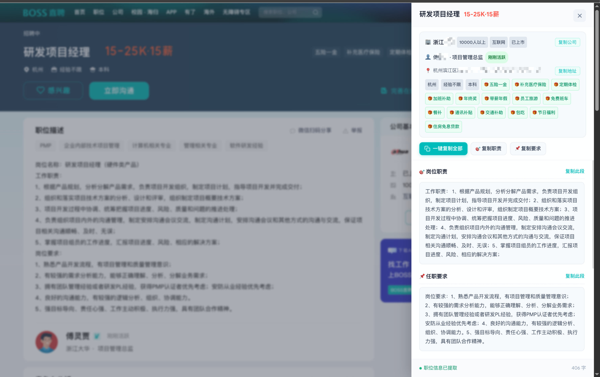

# BOSS 直聘复制助手

<p align="center">
  
</p>

<p align="center">
  <a href="https://github.com/binaryu/boss-copy"></a>
  
  
  
  
</p>

---

### 📖 项目简介

解决 BOSS 直聘网页无法直接复制的问题。支持职位职责与任职要求一键提取、公司全景与规模展示、HR 活跃状态透视、详细工作地址提取，以及自定义 WebFont 薪资乱码智能解密，且零手势冲突。

<p align="center">
  
</p>

---

### 📦 安装与使用

支持以下两种安装方式：

#### 方式一：Tampermonkey 油猴脚本
1. 安装 [Tampermonkey](https://www.tampermonkey.net/) 浏览器扩展。
2. 新建脚本，将本项目中的 [`boss-copy-unlocker.user.js`](https://raw.githubusercontent.com/binaryu/boss-copy/main/boss-copy-unlocker.user.js) 复制粘贴保存即可。

#### 方式二：Chrome / Edge 扩展程序
1. Clone 或下载本仓库代码：
   ```bash
   git clone https://github.com/binaryu/boss-copy.git
   ```
2. 打开浏览器的「扩展管理」页面（`chrome://extensions/` 或 `edge://extensions/`），开启右上角的「开发者模式」。
3. 点击「加载已解压的扩展程序」，选择项目中的 `extension` 目录即可。

---

## ⚠️ 免责声明

1. **用途限制**：本项目仅供个人求职记录、求职笔记整理及前端开发技术学习交流使用。请勿将本项目用于任何形式的商业数据采集、批量爬虫、竞争分析或非法获利行为。
2. **遵守规范**：使用本项目时，请自觉遵守中华人民共和国相关法律法规以及 [BOSS 直聘用户服务协议](https://www.zhipin.com/)。
3. **数据隐私**：本插件属于 100% 纯客户端脚本，所有 DOM 解析与格式化展示均在用户本地浏览器内存中即时完成，**不包含任何远程服务器请求、不收集、不上传任何用户隐私或浏览数据**。
4. **版权归属**：BOSS 直聘（zhipin.com）平台上的所有商标、标识、页面设计及职位信息的著作权与所有权均归北京华品博睿网络技术有限公司及对应企业所有。
5. **责任界定**：作者及贡献者对用户因使用本软件或衍生代码产生的任何直接或间接后果不承担法律责任。

---

## 📄 开源许可证

本项目采用 [MIT License](LICENSE) 许可证。
